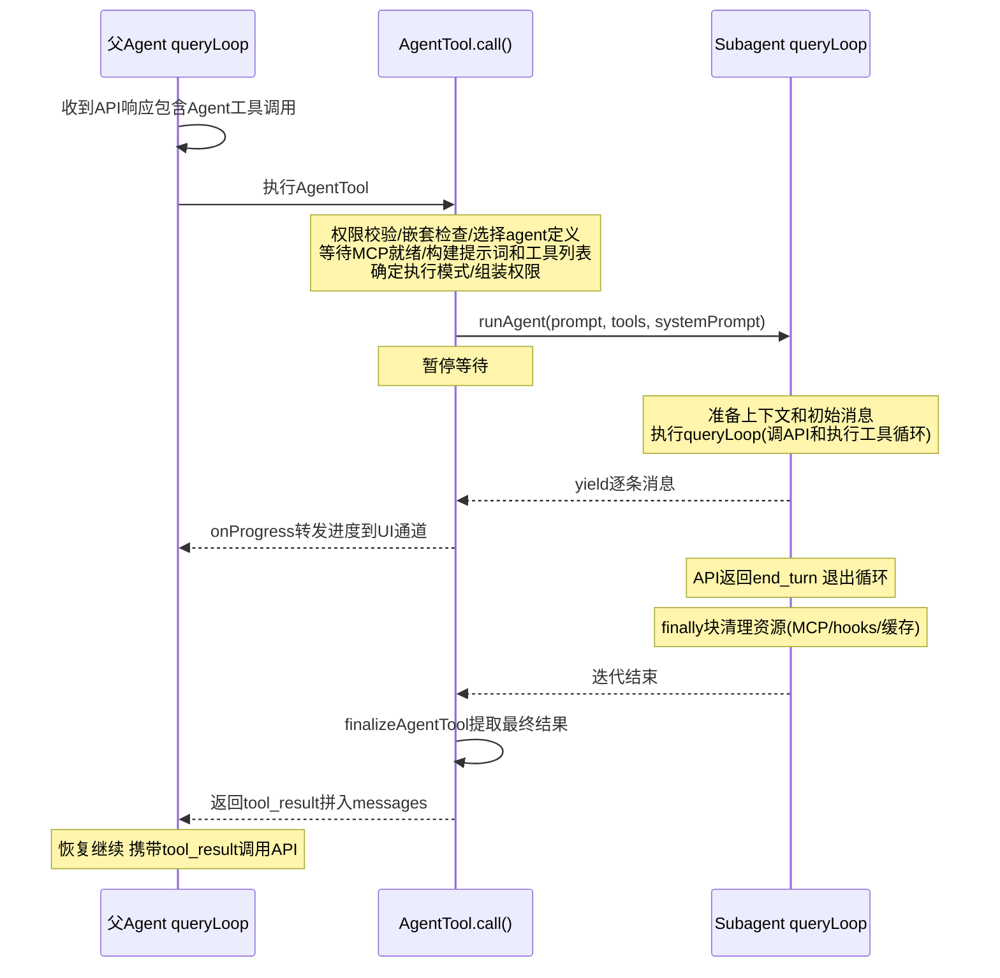
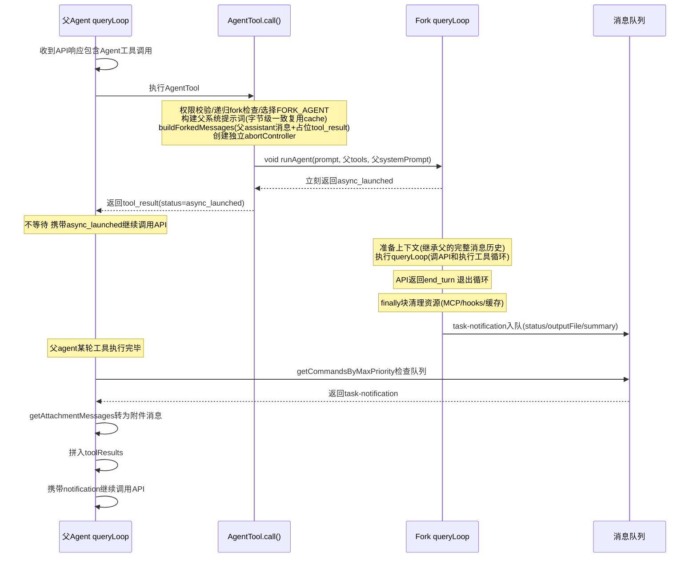
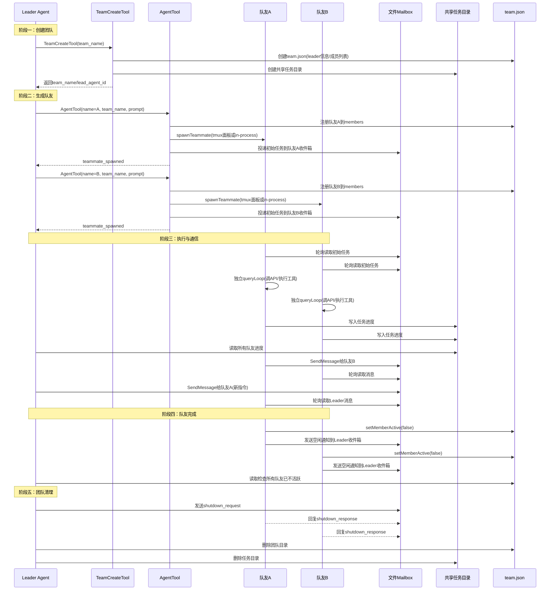
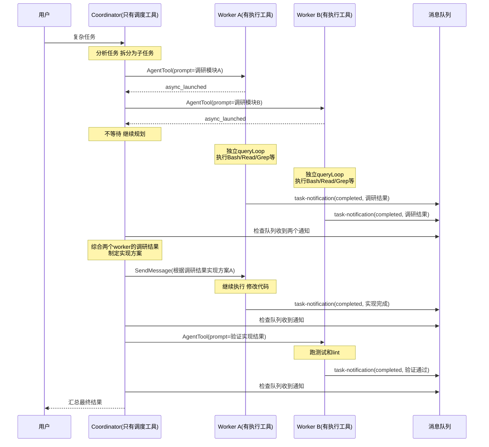

  | 维度 | Subagent | Fork | Team/Swarm | Coordinator |
| --- | --- | --- | --- | --- |
| 关系 | 父→子 | 父→分身 | Leader ↔ 队友 | 指挥官 → 工人 |
| 上下文 | 全新 | 继承全部 | 全新（通过 mailbox 传信息） | 全新 |
| 生命周期 | 一次性任务 | 一次性任务 | 持久化，可 idle 后恢复 | 工人按需创建/销毁 |
| 通信 | 无（返回结果） | 无（返回通知） | 文件 mailbox，双向 | 通过 Agent 工具委派 |
| 进程模型 | 同进程异步 | 同进程异步 | 独立进程 / 同进程 | 同进程异步 |
| 状态共享 | 不共享 | 不共享 | 共享 task list（文件） | 不共享 |
| leader 是否干活 | 是 | 是 | 是 | 否 |
| 互相感知 | 否 | 否 | 是 | 通过 coordinator |
| 适用场景 | 搜索、测试 | 调研、不污染主上下文 | 大项目并行开发 | 复杂编排 |

# Subagent
Subagent 是一个短暂的、一次性的子任务执行器。 父 agent 在执行过程中遇到需要委派的工作时，创建一个 subagent，给它一段任务描述和一组受限的工具，等它跑完拿到结果，然后继续自己的工作。Subagent 拥有全新的上下文——它不知道父 agent 之前聊了什么，只看到分配给它的那一条任务。

它跑的是和父 agent 完全相同的 agent 循环（调 API → 执行工具 → 再调 API），只是工具更少、上下文更小、生命周期更短。跑完之后所有资源被释放，它就不存在了。
父 agent 拿到的结果会作为工具调用的返回值，拼入自己的消息历史，继续下一轮 API 调用。

支持以下6种内置 Agent：
 - Explore — 快速只读搜索代码库，工具限制为 Glob、Grep、Read 等
 - Plan — 设计实现方案，只读不改代码
 - general-purpose — 通用任务执行，支持大多数工具
 - verification — 跑构建、测试、lint，返回 PASS/FAIL 结果，后台运行
 - statusline-setup — 配置终端状态栏显示
 - claude-code-guide — 回答 Claude Code 使用问题，查官方文档

也支持创建自定义的agent。

**LifeCycle**

父 agent 的 queryLoop 暂停，等 subagent 跑完拿到结果才继续。

父agent abort后，subagent也会传递给subagent。



**通信方式**

Subagent只会作为一个tool，执行过程中通过 onProgress 回调向 UI 通道转发实时进度（工具执行状态、bash 输出等）。

执行完成后通过 finalizeAgentTool 提取最终结果，作为 tool_result 返回给父 agent 的消息列表。

它有以下特点：
 
 - 不能创建子agent (构建subagent时会过滤掉 创建agent tool)
 - 全新context, 不能感知其他的agent

# Fork agent

Fork agent和 codex agent有些类似，它继承父 agent 的完整上下文而不是从零开始。父 agent 需要委派一个依赖当前对话背景的任务时，fork 一个自己的"分身"出去处理。Fork 子 agent 拿到父 agent 一模一样的系统提示词和工具列表，消息历史由当前的 assistant 消息加上占位的 tool_result 构成——让 fork 知道父 agent 正在做什么，同时不触发重复的工具执行。因为系统提示词和工具定义与父 agent 字节级一致，fork 可以复用父 agent 的 prompt cache，降低 API 调用成本。

Fork 被一个feature flag控制，看起来是未来的方向。

**LifeCycle**

Fork feature开启时，所有 subagent 被强制为异步执行——启动后立刻返回 async_launched，父 agent 不等待。Fork 完成后通过 task-notification 消息队列通知父 agent。




**通信方式**

和普通 subagent 一致——最终结果作为 tool_result 返回给父 agent。异步模式下通过 task-notification 入队，父 agent 在下轮工具执行后检查队列时收到。

它有以下特点“
- 不能嵌套 fork——fork 子 agent 内部检测到自己是 fork 身份时，Agent 工具会拒绝再次 fork
- 工具列表里包含 Agent 工具，技术上可以创建普通 subagent，但系统提示词明确指示不要这样做


# Team/Swarm
Team/Swarm 是一种多 agent 并行协作模式。Leader agent 在需要并行处理多个任务时生成若干个队友（teammate），每个队友拥有独立的 agent 循环，各自执行分配到的任务。团队结构是扁平的——一个 leader 加多个队友，队友之间平级，不能再生成新的队友。

队友通过 spawnTeammate 创建，根据 --teammate-mode 的设置决定运行方式。tmux 模式下每个队友是一个独立的操作系统进程，在独立的终端面板中运行，真正并行。in-process 模式下队友运行在同一个 Node.js 进程的事件循环中，交替执行。两种模式对上层完全透明，通过统一的 TeammateExecutor 接口抽象。

**LifeCycle**

**Step 1.** 创建团队

AI 调用 TeamCreateTool 创建团队基础设施：在 ~/.claude/teams/{team_name}/ 下创建 team.json，记录团队名称、leader 身份（team-lead@teamName）、成员列表。同时创建共享任务目录 ~/.claude/tasks/{team_name}/。注册到 session cleanup 钩子，确保 leader 退出时能清理。

**Step 2.** 生成队友

AI 多次调用 AgentTool（带 name + team_name 参数），每次通过 spawnTeammate 生成一个队友。队友注册到 team.json 的 members 列表。

tmux 模式下，spawnTeammate 创建终端面板，执行 claude --agent-id ... --agent-name ... --team-name ...，初始任务通过 mailbox 文件投递，队友启动后轮询收件箱读取。

in-process 模式下，直接在同一个进程内启动新的 agent 循环（runAgent），初始任务通过函数参数直接传入，不经过 mailbox。

**Step 3.** 执行与通信

每个队友拥有独立的 agent 循环（queryLoop），独立调用 API 和执行工具。队友之间通过文件 mailbox 通信——每个队友有一个收件箱文件 ~/.claude/teams/{team_name}/inboxes/{agent_name}.json，SendMessageTool 写入消息，接收方通过轮询（约 500ms 间隔）读取。文件锁防止并发写入冲突。

任务进度通过共享的任务目录协调——所有队友的任务状态写在同一个目录下，leader 和其他队友都能读到。

**Step 4.** 队友完成

队友任务完成后，通过 setMemberActive(false) 更新 team.json 中自己的活跃状态，并可选地向 leader 的收件箱发送空闲通知。Leader 通过读取 team.json 检查哪些队友还在活跃。Leader 可以通过 SendMessageTool 给空闲队友分配新任务。

**Step 5.** 团队清理

显式清理：AI 调用 TeamDeleteTool，检查所有队友都已不活跃后，删除团队目录、任务目录和 worktree。

Leader 退出时的自动清理：gracefulShutdown 钩子触发 cleanupSessionTeams，杀掉 tmux 面板中的孤立队友进程，移除团队和任务目录。in-process 队友随进程退出自动终止。

关闭协议：Leader 向队友发送结构化的 shutdown_request 消息，队友回复 shutdown_response 确认后退出。




**通信方式**

是通过文件邮箱的方式，每个team member都有一个自己的文件，当其他agent给当前agent发信息时，会在对应的文件种append一条msg，下面是一条message的示例：

```
{
    "from": "team-lead",
    "text": "subagent-researcher，请你接手任务 #3，调研代码库中 Team/Swarm 模式的实现。调研重点：

  1. 搜索包含 \"TeamCreate\"、\"SendMessage\"、\"teammate\"、\"swarm\"、\"team\" 关键词的源代码文件
  2. Team 的创建和配置机制（配置文件结构、~/.claude/teams/ 目录）
  3. 团队成员之间的通信协议（SendMessage 工具的实现）
  4. 任务列表的协调机制（TaskCreate/TaskUpdate/TaskList 的实现）
  5. Team lead 与 teammate 的角色区别
  6. 团队的 idle 状态管理和生命周期
  7. Team/Swarm 模式与 Subagent/Fork 模式的区别

  请提供详细的代码路径、关键函数和架构总结。完成后通过 SendMessage 向我报告。",
    "summary": "让 subagent-researcher 接手 Team/Swarm 调研",
    "timestamp": "2026-04-08T05:34:00.151Z",
    "read": true
  }
```

Agent 有一个 useInboxPoller，它会每秒钟轮询邮箱，当发现有维度的消息时，会将其包装成XML，并插入到prompt当中，继续ReAct Loop, 最后把消息标记成read=true

```
<teammate-message teammate_id="team-lead">
    subagent-researcher，请你接手任务 #3...
</teammate-message>
```

> P.S. 启动team的方式需要是用户明确要求创建团队，或者任务复杂到需要并行处理。

# Coordinator

Coordinator 模式将主 agent 转变为一个纯粹的任务调度者——它自己不执行任何工具（没有 Bash、Edit、Read），只通过 AgentTool 生成 worker 来干活，通过 task-notification 接收结果，然后综合分析并决定下一步。

Coordinator 只有 4 个工具：

- AgentTool — 生成 worker
- SendMessageTool — 给正在运行的 worker 发后续指令
- TaskStopTool — 停止 worker
- SyntheticOutputTool — 格式化输出


Worker 通过 AgentTool 生成，始终异步运行。Worker 拥有完整的执行工具（Bash、Edit、Read、Grep 等），但没有 TeamCreateTool、SendMessageTool 等协调工具——Worker 只管执行，不管调度。

**LifeCycle**



**通信方式**

Worker 完成后通过 <task-notification> XML 消息入队，Coordinator 在下轮 queryLoop 的工具执行后检查队列时收到。通知包含状态、摘要、结果文本和用量统计。这是单向通信——Worker 向 Coordinator 报告结果，Coordinator 通过 SendMessageTool 向 Worker 发后续指令。

# Appendix
主任务被kill不会影响后台任务

# Questions

Bubble模式怎么传递给父AGENT终端的